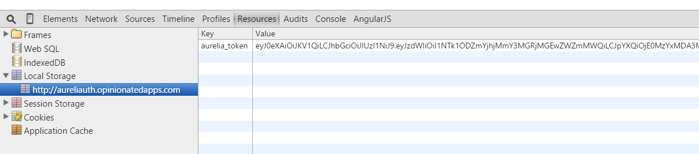
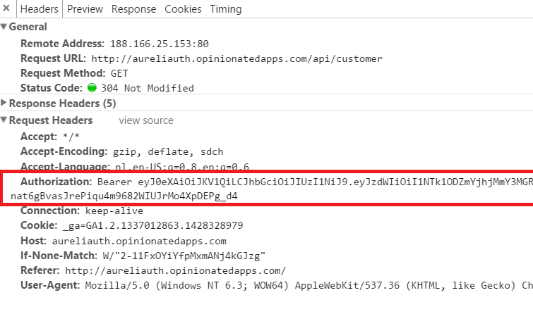

#### Sample app: [aurelia-auth.opinionatedapps.com](http://aureliauth.opinionatedapps.com)
#### Sources sample app: [github.com/paulvanbladel/aurelia-auth-sample] (https://github.com/paulvanbladel/aurelia-auth-sample)

#### On NPM this module is also called [aurelia-auth](https://www.npmjs.com/package/aurelia-auth)

## What is aurelia-auth?
aurelia-auth is a token-based authentication plugin for [Aurelia](http://aurelia.io/) with support for popular social authentication providers (Google, Twitter, Facebook, LinkedIn, Windows Live, FourSquare, Yahoo, Github, Instagram ) and a local strategy, i.e. simple username (email) and password.

aurelia-auth is a port of the great [Satellizer](https://github.com/sahat/satellizer/) library to ES6 and packaged as an Aurelia plugin.

Other OAuth1 and Oauth2 than the above mentioned providers can be simply added by editing the extensible configuration file.

Basically, aurelia-auth does not use any cookies but relies on a JWT (json web token) stored in the local storage of the browser:



Both **local storage** as well as **session storage** can be used (via the aurelia-auth security configuration file).

The aurelia token will be sent automatically to your API when the user is authenticated.



# Installation prerequisites
Obviously, the prerequisites ([NodeJs](https://nodejs.org/), [Gulp](http://gulpjs.com/)) from [Aurelia](http://aurelia.io/). Since aurelia-auth is an [Aurelia plugin](https://github.com/aurelia/skeleton-plugin) , we presume here you have your [Aurelia](http://aurelia.io/) project up and running.

# Installation
```
jspm install aurelia-auth
```
On Npm:
```
Npm install aurelia-auth --save
```

# How to use aurelia-auth?
aurelia-auth does not contain any UI widgets. It's conceived as a simple service with following interface:
```js
login(email, password)
logout(redirectUri)
authenticate(provider, redirect, userData)
signup(displayName, email, password)
getMe()
isAuthenticated()
getTokenPayload()
unlink(provider)
setToken(token)
```
Login is used for the local authentication strategy (email + password). Authenticate is for social media authentication. Authenticate is also used for linking a social media account to an existing account.

## Add an aurelia-auth security configuration file
Add an javascript file to your project where you will store the aurelia-auth  security configuration data. Call it for example authConfig.js.
Since this file is available via the browser, it should never contain sensitive data. Note that for OAuth the clientId is non sensitive. The client secret is sensitive data and should be only available server side. The aurelia-auth config file is compatible with the original Satellizer config file, easing the migration of AngularJs projects to Aurelia.

```js
var configForDevelopment = {
    providers: {
        google: {
            clientId: '239531826023-ibk10mb9p7ull54j55a61og5lvnjrff6.apps.googleusercontent.com'
        }
        ,
        linkedin:{
            clientId:'778mif8zyqbei7'
        },
        facebook:{
            clientId:'1452782111708498'
        }
    }
};

var configForProduction = {
    providers: {
        google: {
            clientId: '239531826023-3ludu3934rmcra3oqscc1gid3l9o497i.apps.googleusercontent.com'
        }
        ,
        linkedin:{
            clientId:'7561959vdub4x1'
        },
        facebook:{
            clientId:'1653908914832509'
        }

    }
};
var config ;
if (window.location.hostname==='localhost') {
    config = configForDevelopment;
}
else{
    config = configForProduction;
}


export default config;

```
The above configuration file can cope with a development and production version (not mandatory of course). The strategy is that when your run on localhost, the development configuration file is used, otherwise the production configuration file is taken.

## Update the aurelia configuration file

In your aurelia configuration file, add the plugin and inject the aurelia-auth security configuration file :
```js
import config from './authConfig';
export function configure(aurelia) {
  aurelia.use
    .standardConfiguration()
    .developmentLogging()
    .plugin('aurelia-animator-css')
    .plugin('aurelia-auth', (baseConfig)=>{
         baseConfig.configure(config);
    });
  aurelia.start().then(a => a.setRoot());
}
```
The above aurelia configuration file consumes the aurelia-auth security configuration file.

## Configure the Fetch Client
In your aurelia app file, inject the {FetchConfig} class from aurelia-auth. We need to explicitely opt-in for the configuration of your fetch client by calling the configure function of the FetchConfig class:
```js
import 'bootstrap';

import {inject} from 'aurelia-framework';
import {Router} from 'aurelia-router';
import {FetchConfig} from 'aurelia-auth';
@inject(Router,FetchConfig, AppRouterConfig )
export class App {

  constructor(router, fetchConfig, appRouterConfig){
    this.router = router;
    this.fetchConfig = fetchConfig;
  }

  activate(){
    this.fetchConfig.configure();
  }
}
```

## What exactly is 'configured' on the Http Client and can we have multiple endpoints?
Well, it's important to have a clear understanding how exactly the default Http Client is
augmented by aurelia-auth and that we have the full freedom to use 
your own custom logic as well.
Let's first show how  aurelia-auth augments the Http Client by 
looking at app.fetch-httpClient.config.js [](https://github.com/paulvanbladel/aurelia-auth/blob/master/src/app.fetch-httpClient.config.js) :


 
```
import {inject} from 'aurelia-dependency-injection';
import {HttpClient} from 'aurelia-fetch-client';
import 'isomorphic-fetch'; // if you need a fetch polyfill
import {Authentication} from './authentication';

@inject(HttpClient, Authentication )
export class FetchConfig {
    constructor(httpClient, authService) {
        this.httpClient = httpClient;
        this.auth = authService;
    }

    configure() {
        this.httpClient.configure(httpConfig => {
            httpConfig
                .withDefaults({
                    headers: {
                        'Accept': 'application/json'
                    }
                })
                .withInterceptor(this.auth.tokenInterceptor);
        });
    }
}
```
So, basically a default Accept header is added and a request interceptor is injected.
'tokenInterceptor' can be found in [authentication.js](https://github.com/paulvanbladel/aurelia-auth/blob/master/src/authentication.js) 
and is responsible for adding the bearer token to each request message making use of the 
default Http Client. 

```
get tokenInterceptor() {
    let config = this.config;
    let storage = this.storage;
    let auth = this;
    return {
      request(request) {
        if (auth.isAuthenticated() && config.httpInterceptor) {
          let tokenName = config.tokenPrefix ? `${config.tokenPrefix}_${config.tokenName}` : config.tokenName;
          let token = storage.get(tokenName);

          if (config.authHeader && config.authToken) {
            token = `${config.authToken} ${token}`;
          }

          request.headers.append(config.authHeader, token);
        }
        return request;
      }
    };
  }
```
So, this behavior is executed automatically when the HttpClient is configured as explained in 'Configure the Fetch Client'.

Now, what if we don't want this to happen for all Http request we make or imagine we have
multiple end points and some of them do not require authentication.

The solution is very simple and based on standard ES 2016 OO techniques: 
derive a custom Http Client.

In aurelia-auth-sample we can find following custom Http Client:

```
import {HttpClient} from 'aurelia-fetch-client';
import {inject} from 'aurelia-framework';
import 'isomorphic-fetch'; // if you need a fetch polyfill
import {AuthService} from 'aurelia-auth';

@inject(AuthService)
export class CustomHttpClient extends HttpClient {
    constructor(auth) {
        super();
        this.configure(config => {
            config
                .withBaseUrl('http://localhost:4000/')
                .withDefaults({
                    credentials: 'same-origin',
                    headers: {
                        'Accept': 'application/json',
                        'X-Requested-With': 'Fetch'
                    }
                })
                //we call ourselves the interceptor which comes with aurelia-auth
                //obviously when this custom Http Client is used for services 
                //which don't need a bearer token, you should not inject the token interceptor
                .withInterceptor(auth.tokenInterceptor)
                //still we can augment the custom HttpClient with own interceptors
                .withInterceptor({
                    request(request) {
                        console.log(`Requesting ${request.method} ${request.url}`);
                        return request; // you can return a modified Request, or you can short-circuit the request by returning a Response
                    },
                    response(response) {
                        console.log(`Received ${response.status} ${response.url}`);
                        return response; // you can return a modified Response
                    }
                });
                });
    }
}
```
We use a simple ES 2015 OO technique: inheritance via the extends keyword.
So, the above custom Http Client uses its own headers and baseUrl and 
has its own interception logic.
Note, that you can still use the aurelia-auth standard interceptor 
for adding the bearer token.

As you can see, no specialised aurelia plugins needed for supporting multiple endpoints !


We can consume this custom Http Client as follows:

```
import {inject, useView} from 'aurelia-framework';
import {CustomHttpClient} from './customHttpClient';
import 'isomorphic-fetch'; // if you need a fetch polyfill
@inject(CustomHttpClient)
@useView('./customer.html')
export class Customer2{
  heading = 'Customer management with custom http service';
  customers = [];

  url = 'api/customer';

  constructor(http){
    this.http = http;
  }

  activate(){

   return this.http.fetch(this.url)
   .then(response =>  response.json())
   .then(c => this.customers = c);
}

}
```

 

## Provide a UI for a login, signup and profile.

See aurelia-auth-samples for more details.

Button actions are passed to the corresponding view model via a simple click.delegate:
```html
<button class="btn btn-block btn-google-plus" click.delegate="authenticate('google')">
          <span class="ion-social-googleplus"></span>Sign in with Google
</button>
```

The login view model will speak directly with the aurelia-auth service, which is made available via constructor injection.
```js
import {AuthService} from 'aurelia-auth';
import {inject} from 'aurelia-framework';
@inject(AuthService)

export class Login{
    constructor(auth){
        this.auth = auth;
    };

    heading = 'Login';

    email='';
    password='';
    login(){
        return this.auth.login(this.email, this.password)
        .then(response=>{
            console.log("success logged " + response);
        })
        .catch(err=>{
            console.log("login failure");
        });
    };

    authenticate(name){
        return this.auth.authenticate(name, false, null)
        .then((response)=>{
            console.log("auth response " + response);
        });
    }
}
```

On the profile page, social media accounts can be linked and unlinked. For a nice UI experience, use  if.bind for either showing the link or unlink button:
```html
<button class="btn btn-sm btn-danger" if.bind="profile.facebook" click.delegate="unlink('facebook')">
    <i class="ion-social-facebook"></i> Unlink Facebook Account
</button>
<button class="btn btn-sm btn-primary" if.bind="!profile.facebook" click.delegate="link('facebook')">
    <i class="ion-social-facebook"></i> Link Facebook Account
</button>
```
## Making the Aurelia Router authentication aware

The logout and profile links are only shown when the user is authenticated, whereas the login link is only visible when the user is not authenticated.

```html
<div class="collapse navbar-collapse" id="bs-example-navbar-collapse-1">
    <ul class="nav navbar-nav">
        <li repeat.for="row of router.navigation | authFilter: isAuthenticated" class="${row.isActive ? 'active' : ''}">
            <a data-toggle="collapse" data-target="#bs-example-navbar-collapse-1.in" href.bind="row.href">${row.title}</a>
        </li>
    </ul>

    <ul if.bind="!isAuthenticated" class="nav navbar-nav navbar-right">
        <li><a href="/#/login">Login</a></li>
        <li><a href="/#/signup">Sign up</a></li>
    </ul>
    <ul if.bind="isAuthenticated" class="nav navbar-nav navbar-right">
        <li><a href="/#/profile">Profile</a></li>
        <li><a href="/#/logout">Logout</a></li>
    </ul>

    <ul class="nav navbar-nav navbar-right">
        <li class="loader" if.bind="router.isNavigating">
            <i class="fa fa-spinner fa-spin fa-2x"></i>
        </li>
    </ul>
</div>
```
Menu items visibility can also be linked with the authFilter to the isAuthenticated value.

In the router config function, you can specifify an auth property in the routing map indicating wether or not the user needs to be authenticated in order to access the route:

```js
configure(){
    var appRouterConfig = function(config){
        config.title = 'Aurelia';
        config.addPipelineStep('authorize', AuthorizeStep); // Add a route filter to the authorize extensibility point.

        config.map([
            { route: ['','welcome'],  moduleId: './welcome',      nav: true, title:'Welcome' },
            { route: 'flickr',        moduleId: './flickr',       nav: true, title:'Flickr' },
            { route: 'customer',        moduleId: './customer',       nav: true, title:'CRM', auth:true },

            ...

            ]);
        };

        this.router.configure(appRouterConfig);
    }
```
In the above example the customer route is only available for authenticated users.

## Supplying token programmatically

In case you would like to supply token programmatically instead of using login functionality, use `setToken(token)`. You might need it to automatically log in user upon registration or on similar use cases.

# Events

At each step of authentication (login, logout, authenticate, signup, unlink), an event is published to Aurelia's event aggregator.
The events published are as follows:

* login: `auth:login`
* logout: `auth:logout`
* authenticate: `auth:authenticate`
* signup: `auth:signup`
* unlink: `auth:unlink`

# Full configuration options.

Via the above mentioned configuration virtually all aspects of the authentication process be tweaked:

```js
  httpInterceptor: true,
  loginOnSignup: true,
  baseUrl: '/',
  loginRedirect: '#/',
  logoutRedirect: '#/',
  signupRedirect: '#/login',
  loginUrl: '/auth/login',
  signupUrl: '/auth/signup',
  profileUrl: '/auth/me',
  loginRoute: '/login',
  signupRoute: '/signup',
  tokenRoot: false,
  tokenName: 'token',
  tokenPrefix: 'aurelia',
  responseTokenProp: 'access_token',
  unlinkUrl: '/auth/unlink/',
  unlinkMethod: 'get',
  authHeader: 'Authorization',
  authToken: 'Bearer',
  withCredentials: true,
  platform: 'browser',
  storage: 'localStorage',
  providers: {
    google: {
      name: 'google',
      url: '/auth/google',
      authorizationEndpoint: 'https://accounts.google.com/o/oauth2/auth',
      redirectUri: window.location.origin || window.location.protocol + '//' + window.location.host,
      scope: ['profile', 'email'],
      scopePrefix: 'openid',
      scopeDelimiter: ' ',
      requiredUrlParams: ['scope'],
      optionalUrlParams: ['display'],
      display: 'popup',
      type: '2.0',
      /*clientId: '239531826023-ibk10mb9p7ull54j55a61og5lvnjrff6.apps.googleusercontent.com',*/
      popupOptions: { width: 452, height: 633 }
    },
    facebook: {
      name: 'facebook',
      url: '/auth/facebook',
      authorizationEndpoint: 'https://www.facebook.com/v2.3/dialog/oauth',
      redirectUri: window.location.origin + '/' || window.location.protocol + '//' + window.location.host + '/',
      scope: ['email'],
      scopeDelimiter: ',',
      nonce: function() {
        return Math.random();
      },
      requiredUrlParams: ['nonce','display', 'scope'],
      display: 'popup',
      type: '2.0',
      popupOptions: { width: 580, height: 400 }
    },
    linkedin: {
      name: 'linkedin',
      url: '/auth/linkedin',
      authorizationEndpoint: 'https://www.linkedin.com/uas/oauth2/authorization',
      redirectUri: window.location.origin || window.location.protocol + '//' + window.location.host,
      requiredUrlParams: ['state'],
      scope: ['r_emailaddress'],
      scopeDelimiter: ' ',
      state: 'STATE',
      type: '2.0',
      popupOptions: { width: 527, height: 582 }
    },
    github: {
      name: 'github',
      url: '/auth/github',
      authorizationEndpoint: 'https://github.com/login/oauth/authorize',
      redirectUri: window.location.origin || window.location.protocol + '//' + window.location.host,
      optionalUrlParams: ['scope'],
      scope: ['user:email'],
      scopeDelimiter: ' ',
      type: '2.0',
      popupOptions: { width: 1020, height: 618 }
    },
    yahoo: {
      name: 'yahoo',
      url: '/auth/yahoo',
      authorizationEndpoint: 'https://api.login.yahoo.com/oauth2/request_auth',
      redirectUri: window.location.origin || window.location.protocol + '//' + window.location.host,
      scope: [],
      scopeDelimiter: ',',
      type: '2.0',
      popupOptions: { width: 559, height: 519 }
    },
    twitter: {
      name: 'twitter',
      url: '/auth/twitter',
      authorizationEndpoint: 'https://api.twitter.com/oauth/authenticate',
      type: '1.0',
      popupOptions: { width: 495, height: 645 }
    },
    live: {
      name: 'live',
      url: '/auth/live',
      authorizationEndpoint: 'https://login.live.com/oauth20_authorize.srf',
      redirectUri: window.location.origin || window.location.protocol + '//' + window.location.host,
      scope: ['wl.emails'],
      scopeDelimiter: ' ',
      requiredUrlParams: ['display', 'scope'],
      display: 'popup',
      type: '2.0',
      popupOptions: { width: 500, height: 560 }
    }
  }
```

More non-Aurelia specific details can be found on the [Satellizer GitHub page](https://github.com/sahat/satellizer/).
